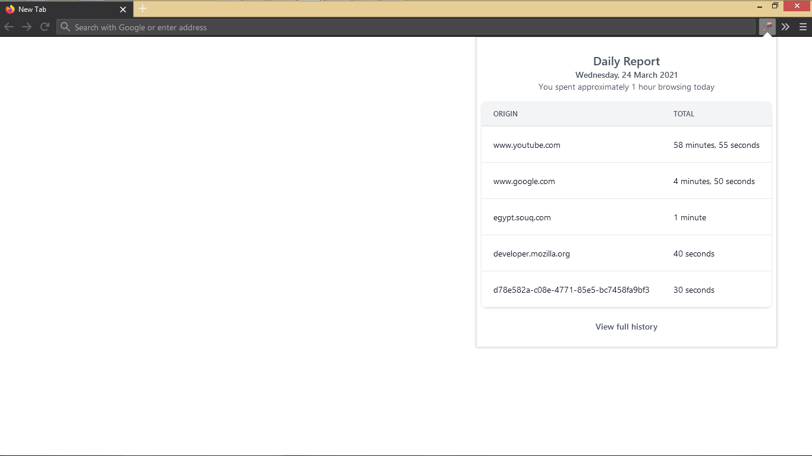
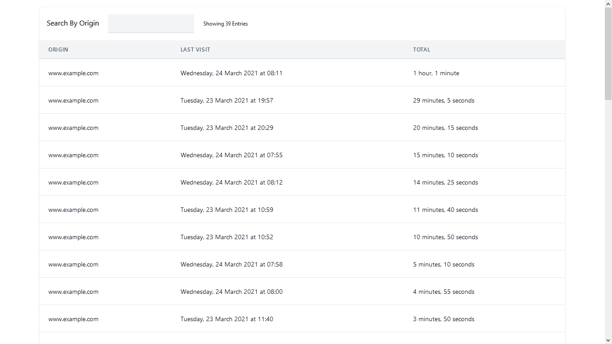

# Loggy!


Gain insights on the time you spend online! Loggy logs the time you spend on
each website to beautifully give you insights on your internet habits when
needed.

## Architecture

The plugin is built using JavaScript, Vue, and sprinkles of Tailwind. This setup is
backed by Webpack to bundle the JavaScript and Vue templates into redistributable output files
that are ready to bundle into the extension xpi. Tailwind is compiled using
PostCSS in the Webpack pipeline.

## Getting Started

Install the addon from the [Mozilla Addons Store](https://addons.mozilla.org/en-US/firefox/addon/loggy/)
and it'll start logging right away!

#### Browser Action

Upon installation the extension will show up in your browser's toolbar. Clicking
it will show a popup with the top 5 websites you visited today alongside an
approximation of the total time you spent browsing.



#### Full Log

Clicking the `Visit full history` link in the browser action will take you to
the full log that contains all websites since you installed the extension.
You'll be able to search and sort the log.



## ✋ Wish to Contribute?

I'm open to all kinds of contributions. If you want to:

```
🤔 Suggest a feature
🐛 Report an issue
📖 Improve documentation
👩‍💻 Contribute to the code
```

You are more than welcome. Before contributing, kindly check the [guidelines](./CONTRIBUTING.md). This repo follows a [code of conduct](/CODE_OF_CONDUCT.md).

## License

This projects is licensed under the GNU GPLv3 License.
